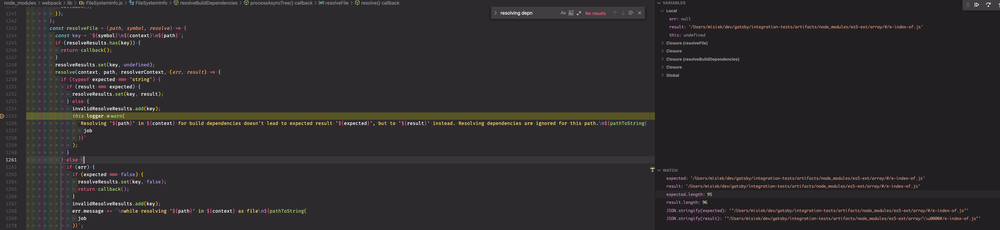

# Minimal repro

Warning:

```
[webpack.cache.PackFileCacheStrategy/webpack.FileSystemInfo] Resolving 'es5-ext/string/#/contains/index' in /Users/misiek/dev/es5-next-null-character/node_modules/d for build dependencies doesn't lead to expected result '/Users/misiek/dev/es5-next-null-character/node_modules/es5-ext/string/#/contains/index.js', but to '/Users/misiek/dev/es5-next-null-character/node_modules/es5-ext/string/#/contains/index.js' instead. Resolving dependencies are ignored for this path.
```

In https://github.com/webpack/webpack/blob/49890b77aae455b3204c17fdbed78eeb47bc1d98/lib/FileSystemInfo.js#L1251-L1260 `expected` and `result` look the same but they aren't. Result has null character that cause strings to not be equal:

```
JSON.stringify(expected) = "\"/Users/misiek/dev/gatsby/integration-tests/artifacts/node_modules/es5-ext/array/#/e-index-of.js\""
JSON.stringify(result) = "\"/Users/misiek/dev/gatsby/integration-tests/artifacts/node_modules/es5-ext/array/\\u0000#/e-index-of.js\""
```



## Repro steps:

- Clone this repository
- Install deps (`npm install`)
- Run build script (`npm run build`)
